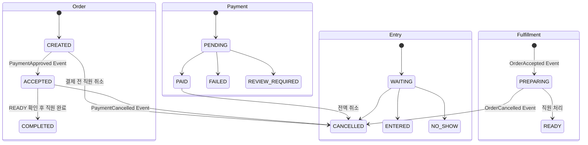
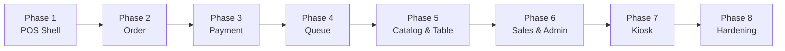

# Doro ERP Frontend 구현 마스터 플랜

> 기준일: 2026-08-17
>
> 대상: 직원 POS와 고객 Kiosk를 통합한 Vue 3 SPA
>
> 실행 방식: 한 번에 한 Phase 문서만 구현하고 검증한다.

## 문서 사용법

구현 담당자는 먼저 [공통 구현 계약](./00_COMMON_CONTRACT.md)을 읽고, 아래 표에서 현재 Phase 문서만 추가로 읽는다. Phase를 건너뛰거나 여러 Phase를 한 번에 수정하지 않는다. 각 Phase 안에서도 Slice 하나를 구현·검증한 뒤 다음 Slice로 이동한다.

각 작업은 `계약 확인 → 실패하는 Test 또는 수용 기준 고정 → 구현 → 회귀 검증 → 상태 기록` 순서로 끝낸다. 화면 파일 생성이나 Mock 정상 응답만으로 다음 Slice로 넘어가지 않는다. 구현 도중 실제 Service와 문서가 다르면 Service Controller·DTO·Enum을 우선하고 차이를 작업 보고에 남긴다.

`GEMINI_HANDOFF.md`의 내용은 이 문서 묶음으로 통합했으며 기존 파일은 삭제했다. 제품·HTTP 계약의 최종 정본은 Front 문서가 아니라 `../../Docs/Specifications/`와 실제 Service 코드다.

## 현재 출발점

| 영역 | 상태 | 처리 방향 |
|---|---|---|
| 인증·직원 Session | API Client와 화면 구현 | `/pos/**`로 이동하고 Kiosk Session과 분리 |
| 공통 HTTP | Cookie·CSRF·Problem Details·401 처리 구현 | 업무 오류와 멱등 재시도 규칙 확장 |
| Table | 목록·생성·수정·상태 변경 구현 | Route와 Role 정비 |
| Audit | 필터·Cursor·상세 구현 | `/pos/history`의 Audit Tab으로 이동 |
| Toss 결제 | 생성·승인 Test Flow 구현 | Order 상세와 Kiosk Checkout에 통합 |
| Order·Catalog·Queue·Sales·Settings | 대부분 정적 UI 골격 | 도메인별 Vertical Slice로 교체 |
| Kiosk | 미구현 | POS와 독립된 Layout·Guard·Store로 구현 |

화면 파일이 있다는 사실만으로 구현 완료로 판단하지 않는다. `ManagementWorkspace` 기반 화면은 목록이 비어 있고 저장 동작이 없는 Placeholder다.

## 2026-08-17 기준 진행 상태

| Phase | 상태 | 다음 작업 |
|---|---|---|
| Phase 1 POS Shell | `FRONT_IMPLEMENTED` | 코드·Unit·Build 완료. Playwright는 실행 환경의 `libglib-2.0.so.0` 부재로 미검증 |
| Phase 2 Order | `INTEGRATION_BLOCKED` | Front·Mock Test 완료. Edge의 Commerce·Table Route 개방 후 실제 연동 검증 필요 |
| Phase 3 Payment | `FRONT_IMPLEMENTED` | Order 상세 결제·승인·전액 취소와 Mock 경계 Test 완료. 실제 Edge 통합은 미검증 |
| Phase 4~8 | `NOT_STARTED` | 앞 Phase 종료 Gate 통과 후 순차 진행 |

Phase 1·2 구현은 `75f7896`에 Commit했다. Phase 3은 검증을 마친 미Commit 작업본이다. `package-lock.json`은 구현과 무관한 선행 변경으로 보존했다. 다음 작업은 [Phase 4 — Queue](./PHASE_04_QUEUE.md)다.

## 올바른 상태 모델



- 직원이 Order를 `ACCEPTED`로 만드는 별도 접수 API는 없다.
- Entry에 `CALLED` 상태나 호출 API는 없다.
- Fulfillment에 `WAITING`·`COMPLETED` 상태는 없다.
- 상태 철자는 `CANCELLED`이며 `CANCELED`가 아니다.

## Phase 실행 순서



| 순서 | 문서 | 결과 |
|---:|---|---|
| 0 | [공통 구현 계약](./00_COMMON_CONTRACT.md) | 모든 Phase에 적용할 경계·보안·완료 기준 |
| 1 | [Phase 1: POS Shell](./PHASE_01_POS_SHELL.md) | `/pos/**` Route, Layout, 인증·Role Guard |
| 2 | [Phase 2: Order](./PHASE_02_ORDER.md) | 판매 메뉴, 주문 생성·목록·상세·취소·완료 |
| 3 | [Phase 3: Payment](./PHASE_03_PAYMENT.md) | Order 결제·승인·조회·전액 취소·불확실 상태 |
| 4 | [Phase 4: Queue](./PHASE_04_QUEUE.md) | Entry와 Fulfillment 운영 화면 |
| 5 | [Phase 5: Catalog & Table](./PHASE_05_CATALOG_TABLE.md) | 상품 관리·품절·Table 관리 |
| 6 | [Phase 6: Sales & Administration](./PHASE_06_SALES_ADMIN.md) | 매출·마감·매장·직원·기기·이력 |
| 7 | [Phase 7: Kiosk](./PHASE_07_KIOSK.md) | 독립 기기 Session과 고객 주문·결제 Flow |
| 8 | [Phase 8: Hardening](./PHASE_08_HARDENING.md) | 공통 오류, 반응형, 핵심 E2E, 최종 검증 |

## 진행 상태 표기

각 Slice의 상태는 다음 중 하나만 사용한다.

| 상태 | 의미 |
|---|---|
| `NOT_STARTED` | 구현 전 |
| `IN_PROGRESS` | 일부 Slice 구현 중이며 Phase 종료 Gate 미통과 |
| `FRONT_IMPLEMENTED` | Front 코드와 Mock 경계 Test 완료 |
| `INTEGRATION_BLOCKED` | Front 구현 완료, Edge·인증·배포 의존성으로 실제 연동 불가 |
| `INTEGRATION_VERIFIED` | 실제 Edge를 통한 API 통합 검증 완료 |
| `E2E_VERIFIED` | 실제 Browser 핵심 Flow까지 검증 완료 |

Mock Test 통과를 `INTEGRATION_VERIFIED` 또는 `E2E_VERIFIED`로 기록하지 않는다.

## Phase 전환 Gate

다음 Phase로 이동하려면 현재 Phase에서 아래를 모두 만족해야 한다.

1. 문서의 요구사항·Route·API 목록과 구현 Diff를 대조한다.
2. 해당 Slice의 Unit·Component Test와 기존 회귀 Test가 통과한다.
3. `npm run type-check`, 검사 전용 Lint, `npm run test:unit -- --run`, `npm run build`가 통과한다.
4. Playwright를 실행하지 못했다면 통과로 표시하지 않고 환경 Blocker와 정적 점검 결과를 남긴다.
5. 미사용 Placeholder와 구 경로를 제거하고 `git diff --check`를 통과한다.
6. 실제 Edge가 닫혀 있으면 우회하지 않고 `INTEGRATION_BLOCKED`로 기록한다.

`npm run lint`는 현재 `--fix`를 포함하므로 검토 단계에서는 먼저 `npx oxlint .`과 `npx eslint . --no-cache`를 실행한다. 구현 완료 단계에서 `npm run lint`를 실행한 뒤 자동 수정 Diff를 재확인한다.

## 전체 완료 조건

모든 Phase의 체크리스트가 끝나고 다음 명령이 통과해야 한다.

```bash
npm run type-check
npm run lint
npm run test:unit -- --run
npm run build
npm run test:e2e
```

E2E 환경이 준비되지 않았다면 통과로 기록하지 않고 정확한 Blocker를 남긴다.
